# Architecture

## Runtime chain

```mermaid
flowchart LR
    Q["Web / Camera API client"] --> H["four_stage_server / VisionHttpServer"]
    H -->|"Camera CRUD / vehicle queries"| DB["PostgreSQL"]
    H -->|"Camera commands / hot state"| R["Redis Streams"]
    R --> W["four_stage_worker / VisionWorkerHost"]
    C["RTSP camera profile"] -->|"one FFmpeg reader per profile"| F["Shared FrameHub"]
    W --> F
    F -->|"independent cursors"| P1["CameraPipeline A"]
    F --> P2["CameraPipeline B"]
    P1 --> JW["bounded JPEG writer pool"]
    P2 --> JW
    JW --> FS["latest / archive JPEG"]
    P1 -->|"latest-only jobs"| IW["fixed vehicle inference workers"]
    P2 --> IW
    VM["validated vehicle TensorRT engines"] --> IW
    IW --> VC["vehicle cascade + track fusion"]
    VC -->|"vehicle events / snapshots"| DB
    DB -->|"fenced outbox lease"| CB["callback delivery worker"]
    CB -->|"HMAC-signed HTTP POST"| BE["external backend"]
    W -->|"pipeline / inference / callback heartbeat"| R
    DB --> H
    R --> H
```

The HTTP process does not load CUDA, TensorRT, camera credentials, callback
secrets, or database credentials from requests. It persists Camera lifecycle
changes, submits non-secret commands to Redis, and combines durable PostgreSQL
records with expiring Worker hot state.

The single Worker process owns camera URI resolution, the FrameHub registry,
one FFmpeg reader per profile, CameraPipeline threads, fixed vehicle inference
workers, JPEG publication, vehicle-event persistence, and callback delivery.
The first release requires `worker_num=1`; process-local sharing cannot prevent
two independent Workers from opening duplicate RTSP connections.

## Public API

- `GET /api/v1/health`
- `GET /api/v1/ready`
- `POST/GET /api/v1/cameras`
- `GET/PATCH/DELETE /api/v1/cameras/{camera_id}`
- `POST /api/v1/cameras/{camera_id}/start`
- `POST /api/v1/cameras/{camera_id}/stop`
- `GET /api/v1/cameras/{camera_id}/status`
- `GET /api/v1/cameras/{camera_id}/latest-frame`
- `GET /api/v1/cameras/{camera_id}/runs`
- `GET /api/v1/cameras/{camera_id}/alerts`
- `GET /api/v1/camera-hubs`
- `GET /api/v1/camera-hubs/{profile}`
- `GET /api/v1/vehicles/realtime`
- `GET /api/v1/vehicles/events`

Every mutation and operational query uses Bearer authentication. Camera
profiles are deployment-owned and read-only over HTTP. Classification,
segmentation, generic upload/video routes, and the legacy person-analysis API
are not registered.

## Shared Hub and fault domains

The first subscription creates a profile Hub; later subscriptions receive
independent latest-frame cursors. After the last subscriber leaves, idle grace
prevents reconnect churn before the Hub closes. RTSP reconnect and resolution
changes are shared camera-level state, while extraction, encoding, storage, and
inference failures are isolated to their consumer or Run.

Frame objects are `shared_ptr<const FrameEnvelope>`. JPEG and analysis sampling
use independent monotonic cadences. Analysis jobs retain at most one pending
latest frame per camera, and generation tokens discard in-flight results from
a stopped or replaced Run.

## Vehicle inference and persistence

Validated vehicle-detection and vehicle-attribute engines are loaded once per
runtime worker. Detection, crop quality gating, attribute micro-batching,
camera-local tracking, and multi-frame fusion produce a single finalized
vehicle event per track. Low-confidence attributes remain `unknown`.

PostgreSQL stores Camera desired state, Runs, frame metadata, vehicle events,
analysis snapshots, and callback outbox rows. Redis carries non-secret
commands, leases, stop flags, heartbeats, and hot status only. Snapshot/archive
publication uses temporary files followed by atomic replacement, and metadata
is inserted only after file publication succeeds.

Callback events and their outbox rows commit in one transaction. The delivery
worker uses fenced `FOR UPDATE SKIP LOCKED` leases, bounded exponential retry,
dead-letter state, HMAC signatures, and stable event IDs for receiver-side
deduplication. `/ready` fails closed when the Worker heartbeat or required
vehicle inference components are missing or stale.
